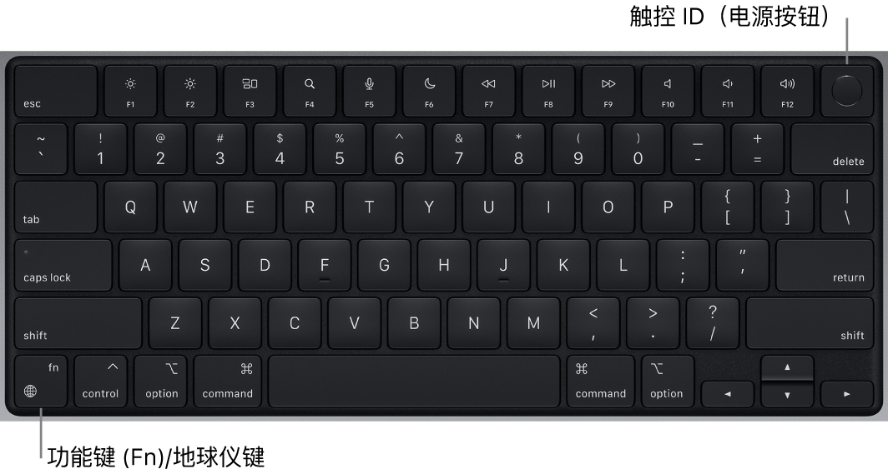

# MacBook Tips

# guide
- 多用键盘、触摸板，少用鼠标
# 熟悉使用macbook笔记本电脑的小技巧和快捷键
- Mac使用技巧大整合：基础篇+进阶篇
  - https://zhuanlan.zhihu.com/p/89987302

- 如何高效记住 Mac 的快捷键？
  - https://www.zhihu.com/question/24757023

> 就看这两篇，有什么不清楚的，自己在 https://www.zhihu.com/ 网站搜索，需要注册一个知乎账号

- 使用Mac的100个小技巧 (可不看，只需了解下留个印象)
  - https://www.bilibili.com/video/BV1Xc411h7ve
# more

